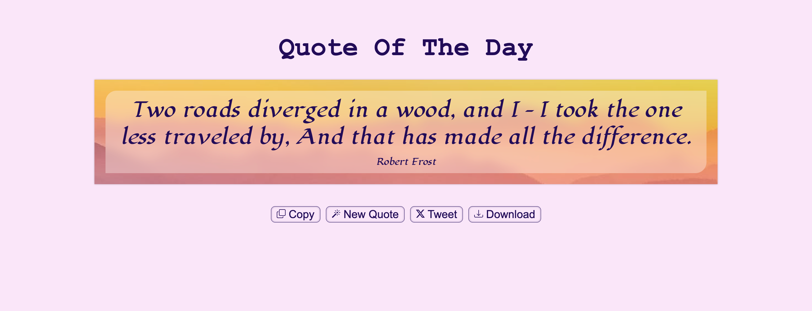
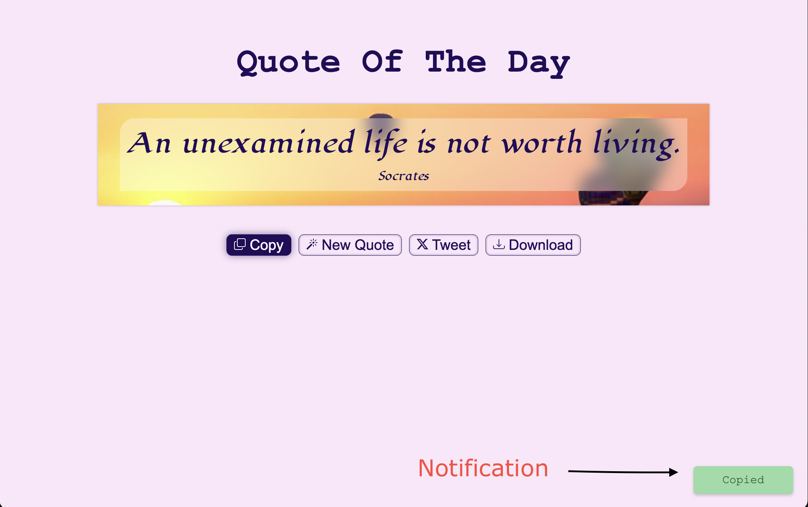

# Quote of the Day 🌅💭📝

A simple web browser application which generates random __❝Quote❞__

---

## 🌟 Application Features

> * 🤌🏻 Displays a Quote with _beautiful background image_
> * 📋 Copies the Quote on to *clipboard*
> * 🪄 Generates new Quote - on browser load & on clicking ___New Quote__ button_
> * 𝕏 Can share the quote on **X** _(twitter)_
> * 📥 Creates a _copy_ of the __Quote along with background image__ and downloads it.

## 📸 Screenshots

1. Screen on load 

Displays the **Quote** on a beautiful background image.

2. Pops up notification for coping the quote

3. Downloaded image on clicking download button

## 🔗 Deployment Link

[Github-Pages](https://bvvinaykumar45.github.io/quote-of-the-day)
